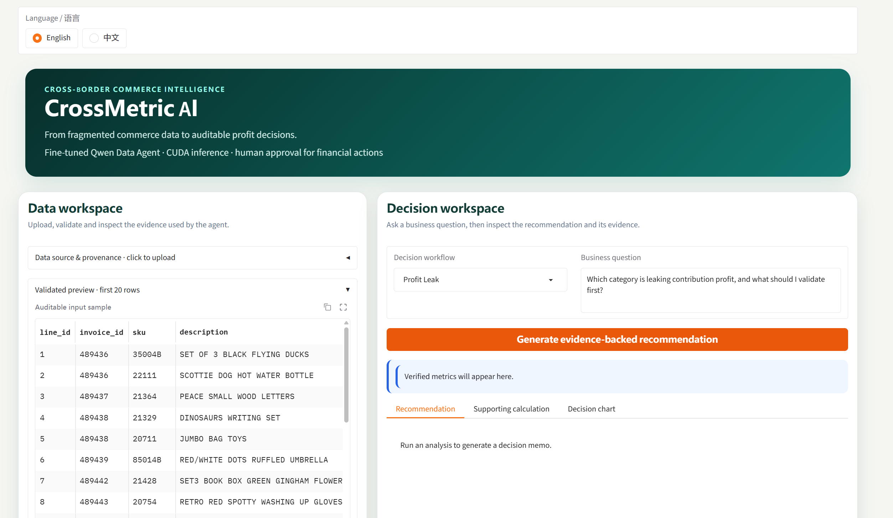

# CrossMetric AI

A bilingual commerce analytics prototype combining a fine-tuned small language
model, deterministic calculations and guarded recommendations. This is a
portfolio prototype, not a production financial decision system.



## Features

- English/Chinese Gradio UI, CSV validation and evidence preview.
- Profit leakage, paid-channel efficiency, demand concentration and trend analysis.
- Python-computed findings for the first three workflows, constrained model
  interpretation and safe-template fallback on failed validation.
- A 1,500-draw Monte Carlo scenario tool using simulated assumptions.
- Qwen3.5-0.8B full-parameter SFT and Ray experiment orchestration.

Trend Diagnosis lacks the same narrative guardrail as the first three workflows.
No automatic budget, payment, purchase or inventory changes occur.

## Run

Use Python compatible with your PyTorch/CUDA stack. Install CUDA-compatible
PyTorch, then:

```bash
pip install -r requirements.txt
bash app/run_gpu.sh /path/to/fine-tuned-model 6008
```

Alternatively:

```bash
python app/crossmetric_app.py --checkpoint-path /path/to/model --local-files-only --server-name 127.0.0.1 --server-port 6008 --max-new-tokens 768
```

Weights are not bundled. Open `http://127.0.0.1:6008` on the server machine.
For a remote GPU, run this on your laptop in another terminal:

```bash
ssh -N -L 7862:127.0.0.1:6008 -p <ssh-port> <user>@<host>
```

Open `http://127.0.0.1:7862` on the laptop. Keep both processes running.
Add `-i /path/to/private-key` if needed; never commit the key.

## Data and tests

The demo contains 65,000 UCI Online Retail II transaction lines. Revenue comes
from observed quantities/prices. Categories are rule-derived; channels, costs,
advertising, fees, fulfilment and inventory fields are simulated.
See [Data card](data/DATA_CARD.md). CSV fixtures: `data/test_cases/`.

```bash
python evaluation/guardrail_regression.py
```

To rebuild data, place the UCI workbook at
`data/raw/online_retail_ii/online_retail_II.xlsx`, then run
`python data/prepare_demo_data.py`.

## Training and recorded results

The executed pipeline uses deterministic multidimensional reward scores, hash
deduplication, TF-IDF character n-gram near-deduplication and per-source caps.
It did not use Sentence-Transformers/K-means or the optional GLM judge.
It is not a learned reward-model or reinforcement-learning pipeline.

| Stage | Remaining trajectories |
|---|---:|
| Source | 11,707 |
| Exact deduplication: 207 removed | 11,500 |
| Near deduplication: 199 removed | 11,301 |
| Quality/diversity selection | 2,500 |
| Group-disjoint train/validation split | 2,000 / 500 |

8,801 non-selected candidates were excluded by ranking, caps and target size,
not all proven invalid. Recorded group/ID/message-hash overlaps: zero.

```bash
python training/select_trajectories.py --input /path/to/datamind_12k.json --output-dir data/training/selected
python training/train_qwen_ray.py --learning-rates 2e-5 --max-length 2048 --epochs 1
```

Inspect `--help` for settings. Download upstream data/model separately and respect
their terms. Recorded validation loss: 0.731607 to 0.488760 (33.2% decrease).
This is teacher-forced loss, not task success. See [Model card](docs/MODEL_CARD.md).

## Architecture: design only

100,000 connections, 10,000 peak API RPS and 500 concurrent LLM streams are
distinct proposed workloads, not achieved results. They have not been load-tested.
See [System design](docs/SYSTEM_DESIGN.md).

## Layout and limitations

`app/`: final app; `training/`: selection/SFT; `data/`: preparation/CSVs;
`evaluation/`: metrics/tests; `docs/`: architecture, model card and LaTeX report;
`assets/`: illustrative screenshots, possibly from an earlier UI revision.

- Fallback is deterministic text, not successful model reasoning.
- Tests do not measure end-to-end GPU generation or concurrency.
- Historical UK transactions do not represent current merchant economics.
- No credentials, checkpoint or private raw data is bundled.
- Code license is not selected; publication alone grants no reuse license.
  UCI data retains its separate CC BY 4.0 terms.
- LLM-assisted development/documentation is disclosed in the report.
