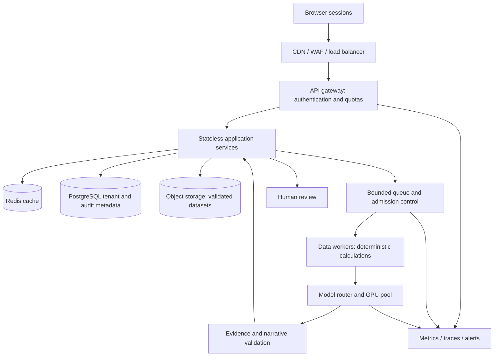

# Proposed production architecture

Status: design proposal, not deployed infrastructure or a load-test result.
The working app is a Gradio process with local calculations and GPU inference.

| Design target | Meaning | Status |
|---|---|---|
| 100,000 connections | Mostly idle connected sessions | Not tested |
| 10,000 peak API RPS | Mixed cached/metadata/submission requests | Not tested |
| 500 LLM streams | Admitted concurrent generations | Not tested |

A single demo GPU is not claimed to achieve these targets. Benchmark capacity
against prompt/output length, batching and latency. Bound queues and use
per-tenant quotas, cancellation and overload responses.

Validate file size/schema/types; isolate tenants and encrypt data. Treat uploads
as untrusted input. Audit dataset hashes, calculation/model versions and fallback
reasons. Require human approval for business actions. Cache by tenant, dataset
and configuration, not just the question. Monitor queue age, latency percentiles,
GPU memory/utilization, errors and fallback frequency. Use staged rollouts and
rollbackable models. Test workload mixes, failures, restoration and tenant
isolation before making production-scale claims.
